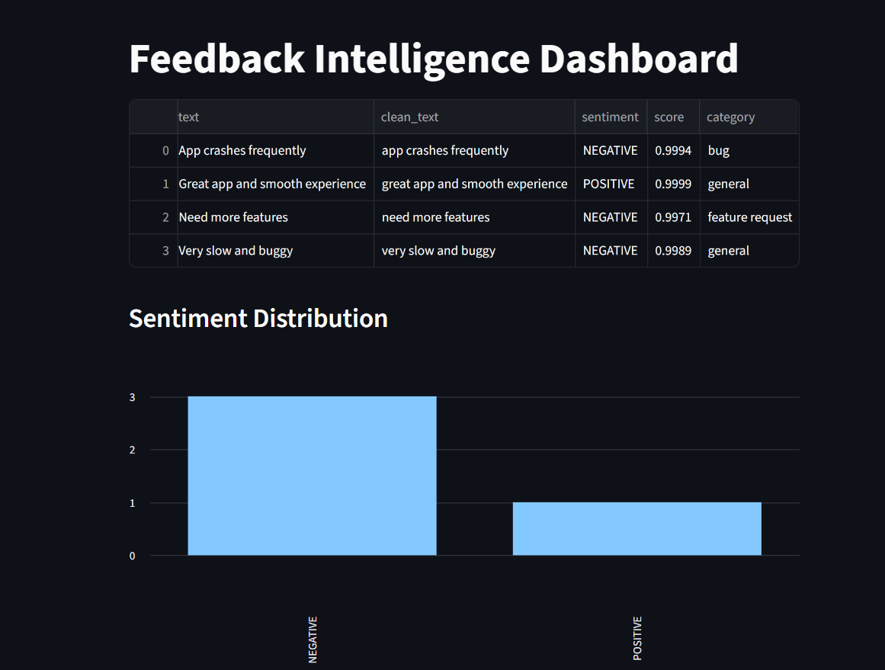
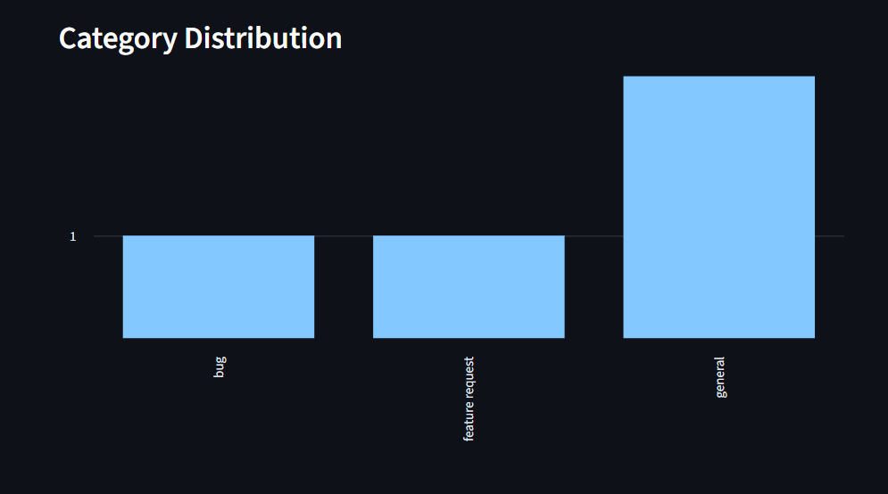

# 🚀 Multi-Source Feedback Intelligence System

A production-style **Feedback Intelligence System** that collects, analyzes, and transforms customer feedback into actionable insights using **AI + rule-based methods**.

---

## 📌 Overview

This project aggregates feedback from multiple sources (CSV, APIs like Google Play Store, etc.) and processes it through a structured pipeline:

* 🧹 Text Cleaning & Normalization
* 😊 Sentiment Analysis (AI-based)
* 🏷️ Smart Categorization (Bug / Feature / General)
* ⚡ Priority Identification
* 📊 Interactive Dashboard (Streamlit)

It enables product teams to:

* Detect recurring issues
* Track customer sentiment trends
* Prioritize critical feedback
* Make data-driven decisions

---

## 🧱 Architecture

```
Data Sources → Ingestion → Processing → Intelligence → Dashboard/Reports
```

---

## 🛠️ Tech Stack

| Layer    | Technology                               |
| -------- | ---------------------------------------- |
| Backend  | Python                                   |
| ML / AI  | Transformers (HuggingFace), scikit-learn |
| Frontend | Streamlit                                |
| Data     | Pandas                                   |
| Reports  | ReportLab                                |
| APIs     | Google Play Scraper                      |

---

## ⚙️ Setup Guide

### 1. Clone Repository

```
git clone https://github.com/your-username/feedback-intelligence-system.git
cd feedback-intelligence-system
```

---

### 2. Create Virtual Environment

```
python -m venv venv
```

Activate:

* Windows:

```
venv\Scripts\activate
```

* Mac/Linux:

```
source venv/bin/activate
```

---

### 3. Install Dependencies

```
pip install -r requirements.txt
```

---

### 4. Run the App

```
streamlit run app.py
```

---

## 📂 Project Structure

```
feedback_intelligence/
│
├── src/
│   ├── ingestion/
│   ├── processing/
│   ├── intelligence/
│   ├── actions/
│
├── data/
├── app.py
├── requirements.txt
└── README.md
```

---

## 🔌 API Setup

### Google Play Reviews

```
pip install google-play-scraper
```

Example:

```python
from google_play_scraper import reviews

reviews_data, _ = reviews(
    'com.instagram.android',
    lang='en',
    country='in',
    count=100
)
```

---

## 📊 Features

* ✔ Multi-source feedback collection
* ✔ AI-based sentiment analysis with confidence scores
* ✔ Automatic categorization (bug, feature, general)
* ✔ Interactive dashboard with visual insights
* ✔ Modular and scalable architecture

---

## 📸 Dashboard Screenshots

### Dashboard Overview


### Category Chart


---

## 📈 Sample Insights

* Negative feedback like *"App crashes frequently"* is categorized as **bug**
* Feature requests like *"Need more features"* are identified automatically
* Sentiment confidence scores help prioritize issues

---

## ⚠️ Limitations

* Basic rule-based categorization
* Limited dataset (CSV demo)
* No real-time streaming yet

---

## 🚀 Future Improvements

* Real-time feedback ingestion
* Multi-language support
* Predictive analytics
* LLM-based insight generation
* FastAPI backend integration

---

## 👨‍💻 Author

**Mohammed Saif R**

---

## YouTube
Demo video : ""

## ⭐ Support

If you like this project, give it a ⭐ on GitHub!
